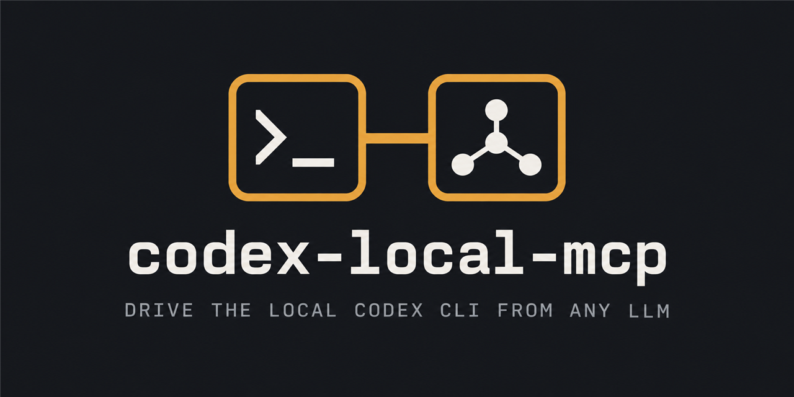

<p align="center">
  
</p>

<p align="center">
  <a href="https://github.com/ossmalaysia/codex-local-mcp/actions/workflows/ci.yml"></a>
  <a href="LICENSE"></a>
</p>

# codex-local-mcp

An MCP server that lets any LLM drive your **local Codex CLI**.

The calling model sends a task in plain English. Codex writes and runs code inside an
isolated workspace folder on your machine. The server returns Codex's output, the list of
files it created, and the images inline.

Codex generates images natively, so `codex_generate_image` needs no image API key — your
existing `codex login` is enough.

> **This runs code on your computer.** Anything that can call these tools can make Codex
> execute code as you, inside its sandbox. Read [SECURITY.md](SECURITY.md) before using it.

## Requirements

- Node.js 20 or newer
- [Codex CLI](https://github.com/openai/codex) installed and logged in
- Windows, macOS or Linux

## Install

New to this? Follow the **[step-by-step setup guide](SETUP.md)** instead, which covers
finding your paths, configuring each client, verifying it works, and troubleshooting.

```bash
npm install -g @openai/codex   # the Codex CLI itself
codex login                    # one time

git clone https://github.com/ossmalaysia/codex-local-mcp.git
cd codex-local-mcp
npm install
npm run build
```

## Connect it to a client

> Full walkthrough with per-OS paths and troubleshooting: **[SETUP.md](SETUP.md)**.

This is a **stdio** server: the client launches it as a child process. There is no URL and
nothing listens on a port.

Use **absolute paths** for `command` and for `CODEX_BIN`. MCP clients launch servers with a
minimal environment in which bare `node` and `codex` may not resolve.

### Claude Desktop

Add to `claude_desktop_config.json`, then fully quit and reopen the app.

- Windows: `%APPDATA%\Claude\claude_desktop_config.json`
- macOS: `~/Library/Application Support/Claude/claude_desktop_config.json`

```json
{
  "mcpServers": {
    "codex": {
      "command": "/absolute/path/to/node",
      "args": ["/absolute/path/to/codex-local-mcp/dist/index.js"],
      "env": {
        "CODEX_BIN": "/absolute/path/to/codex",
        "CODEX_MCP_ROOT": "/absolute/path/to/codex-workspaces",
        "CODEX_TIMEOUT_SEC": "600"
      }
    }
  }
}
```

On Windows the values look like `C:/Program Files/nodejs/node.exe` and
`C:/Users/you/AppData/Roaming/npm/codex.cmd`. Forward slashes work fine.

Find the right paths with `which node` / `which codex` (macOS, Linux) or
`(Get-Command node).Source` / `(Get-Command codex).Source` (PowerShell).

### Claude Code

```bash
claude mcp add codex -s user -- node /absolute/path/to/codex-local-mcp/dist/index.js
```

### Anything else

Any MCP client that can launch a stdio server works. Point it at
`node /absolute/path/to/dist/index.js`.

## Tools

| Tool | Arguments | Description |
|---|---|---|
| `codex_run` | `prompt`, `workspace?`, `timeout_sec?`, `model?` | Run any task. Blocks until Codex finishes. |
| `codex_generate_image` | `prompt`, `count?`, `size?`, `quality?`, `workspace?`, `open?` | Generate images. The prompt is passed through as written. |
| `codex_read_artifact` | `path`, `max_bytes?` | Read a file from a workspace. |

Reuse the same `workspace` name across calls to keep working on the same files.

`codex_generate_image` defaults to `quality: "low"` and `size: "1024x1024"` — a fast draft.
`size` must be `WIDTHxHEIGHT` or `auto`; a malformed value is rejected before Codex runs. The
size is a request to Codex rather than something the server can enforce, so the result
reports each image's actual dimensions and flags any that differ from what was asked.
Raise `quality` to `high` for final assets. `open` defaults to `true` and opens each image in
your default viewer, because MCP clients deliver tool-result images to the *model's* context
and do not render them into the chat for you.

## Configuration

All optional, set through the client's `env` block.

| Variable | Default | Purpose |
|---|---|---|
| `CODEX_MCP_ROOT` | `~/.codex-mcp/workspaces` | Root for all workspaces. Nothing is written outside it. |
| `CODEX_BIN` | `codex` | Absolute path to the Codex CLI. |
| `CODEX_MODEL` | *(Codex default)* | Model override. |
| `CODEX_TIMEOUT_SEC` | `300` | Default timeout before a run is killed. |
| `CODEX_MAX_TIMEOUT_SEC` | `1800` | Ceiling a caller may request. |
| `CODEX_MAX_OUTPUT_CHARS` | `40000` | Output cap; the head and tail are kept. |
| `CODEX_MAX_INLINE_IMAGE_BYTES` | `1048576` | Above this, a downscaled preview is inlined instead. |
| `CODEX_MAX_REPORTED_FILES` | `200` | Cap on reported changed files. |
| `CODEX_NETWORK_ACCESS` | `true` | Set `false` to deny Codex the network. |

## How it works

Codex runs as `--sandbox workspace-write`: it can read and write **only inside the workspace
folder**, plus reach the network. Workspace names that would escape the root are refused.

A few decisions worth knowing about:

- **Artifacts are found by filesystem diff.** The workspace is snapshotted (path → mtime+size)
  before and after each run, so whatever Codex does, new files are detected. No output parsing.
- **The prompt travels on stdin** (`codex exec ... -`), so prompt text is never shell-quoted
  and cannot break out into the command line.
- **Budgets are counted in base64 characters, not file bytes.** Encoding inflates data by 4/3,
  so a budget expressed in file bytes overshoots what the client actually receives by a third.
  Images are downscaled until their *encoded* form fits, and a per-response budget caps all of
  them together. Originals on disk are never modified.
- **Full-resolution files are linked, not embedded.** Every reported file also comes back as an
  MCP `resource_link`. The server declares the `resources` capability and serves workspace
  files through `resources/read`, so a client can fetch the original on demand instead of
  having megabytes pushed into every response. Reads outside the workspace root are refused.
- **Generated images open in the OS viewer**, since clients don't render tool-result images.
- **Timeouts kill the whole process tree**, so a stuck build leaves no orphans.

## Development

```bash
npm test          # runs against a fake Codex - no CLI or API key needed
npm run build
```

See [CLAUDE.md](CLAUDE.md) for architecture and the invariants to preserve, and
[CONTRIBUTING.md](CONTRIBUTING.md) before opening a pull request.

CI runs the build, the test suite and `npm audit` on Ubuntu, Windows and macOS against
Node 20 and 22, plus weekly CodeQL analysis.

## Versioning

This project follows [Semantic Versioning](https://semver.org/). Releases are cut automatically
from [Conventional Commits](https://www.conventionalcommits.org/) and published as tags with
release notes on the [Releases page](https://github.com/ossmalaysia/codex-local-mcp/releases).
To use a specific release, check out its tag:

```bash
git checkout v0.1.0   # or any later tag
```

While the major version is `0`, minor releases may still contain breaking changes, which are
always called out in the release notes.

## Security

Please read [SECURITY.md](SECURITY.md). Report vulnerabilities privately through GitHub's
**Security → Report a vulnerability**, not as a public issue.

## License

[MIT](LICENSE) © OSS Malaysia
